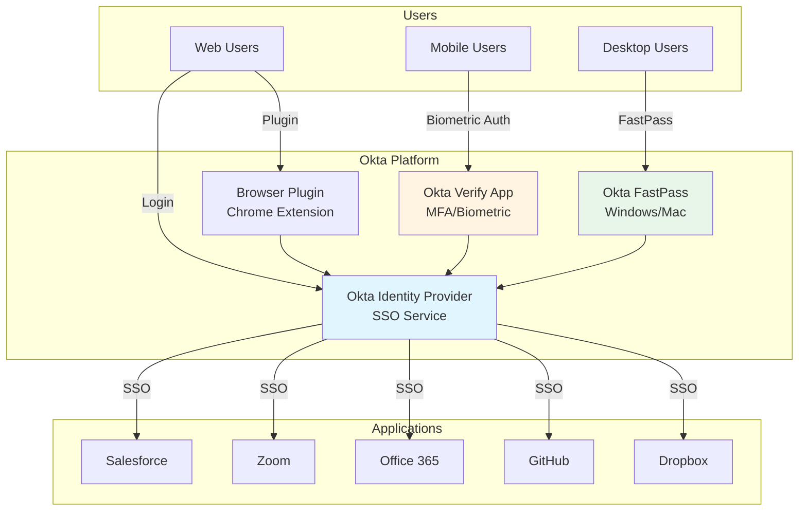
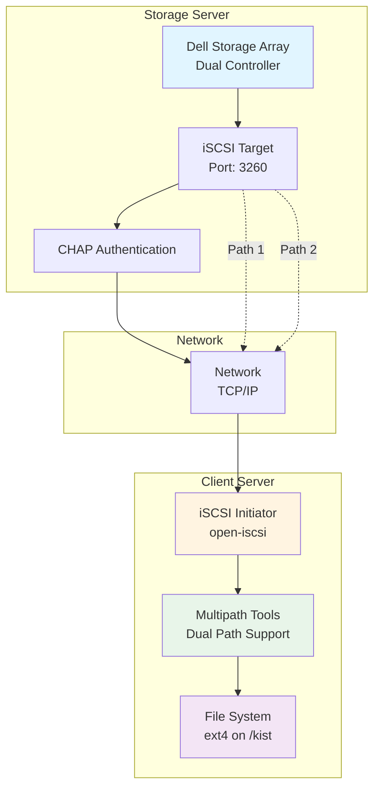
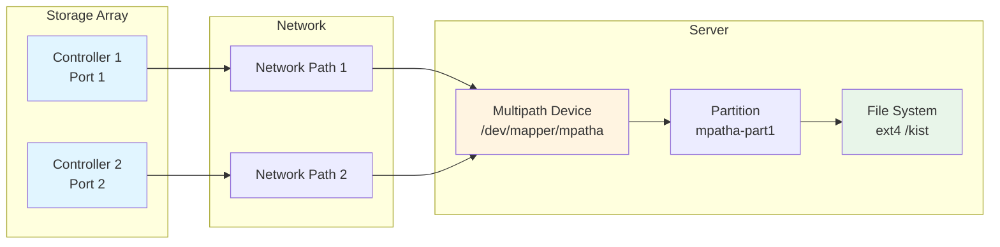

# Infrastructure Tools

> Consolidated repository for infrastructure and system administration tools

## 📋 Overview

This repository consolidates various infrastructure tools and system administration utilities, including identity management, storage solutions, and system configuration.

## 🏗️ Architecture

### Okta Identity Management Architecture



### iSCSI Storage Architecture



### Multipath Configuration



## 📁 Projects

### [Okta](./Okta/)

Comprehensive Okta integration and user management guide.

**Features:**
- Single Sign-On (SSO) configuration
- Multi-Factor Authentication (MFA) setup
- Biometric authentication (Android & iOS)
- Okta Verify app configuration
- FastPass setup for Windows and Mac

**Key Components:**
- User activation guide
- MFA enrollment instructions
- Biometric authentication setup
- Browser plugin configuration

### [server-storage](./server-storage/)

iSCSI storage configuration and management for server infrastructure.

**Features:**
- iSCSI initiator configuration
- CHAP authentication setup
- Multipath configuration for dual controllers
- Auto-mount setup with fstab
- Large partition management (>2TB)

**Key Components:**
- iSCSI installation and configuration
- Multipath tools setup
- Partition management
- Error recovery procedures

## 🚀 Quick Start

### Okta Setup

1. **Activate Okta Account**
   - Click the activation link in the email
   - Log in with temporary password

2. **Enroll in MFA**
   - Navigate to Settings
   - Enroll in Okta Verify MFA
   - Scan QR code with mobile device
   - Enable biometric authentication

3. **Install Browser Plugin**
   - Install [Okta Browser Plugin](https://chrome.google.com/webstore/detail/okta-browser-plugin/) for Chrome
   - Enable FastPass for Windows/Mac

### iSCSI Storage Setup

1. **Install iSCSI Tools**
   ```bash
   sudo apt-get update && sudo apt-get upgrade -y
   sudo apt -y install open-iscsi
   ```

2. **Configure Initiator**
   ```bash
   sudo nano /etc/iscsi/initiatorname.iscsi
   # Set InitiatorName to match storage server IQN
   ```

3. **Discover and Connect**
   ```bash
   iscsiadm -m discovery -t sendtargets -p <storage-ip>
   iscsiadm -m node --login
   ```

## 📖 Detailed Documentation

### Okta

- [Okta User Guide](./Okta/ReadME.md) - Comprehensive Okta setup and usage guide
- [Okta Integration Guide](./Okta/Integration/ReadME.md) - Integration instructions

### Server Storage

- [iSCSI Configuration Guide](./server-storage/README.md) - Complete iSCSI setup and troubleshooting

## 🔧 Troubleshooting

### Okta Issues

- **Login Problems**: Use "Verify another way" for alternative authentication
- **Biometric Issues**: 
  - Android: Check [Google Issue Tracker](https://issuetracker.google.com/issues/195330769)
  - iOS: Ensure Touch ID/Face ID is enabled in device settings
- **FastPass Issues**: Ensure Okta Verify app is installed and MFA is configured

### iSCSI Issues

- **Connection Problems**: Verify CHAP credentials match storage configuration
- **Multipath Issues**: Ensure both iscsid and open-iscsi services are running
- **Boot Issues**: Use GRUB recovery mode or boot-repair tool

## 🔒 Security Considerations

### Okta Security

- Always enable MFA for enhanced security
- Use biometric authentication when available
- Keep Okta Verify app updated
- Regularly review access logs

### iSCSI Security

- Use CHAP authentication for all connections
- Restrict iSCSI access to authorized networks
- Encrypt sensitive data on iSCSI volumes
- Regularly audit storage access logs

## 📝 License

Please refer to individual project licenses.

## 👤 Author

**Twodragon**
- GitHub: [@Twodragon0](https://github.com/Twodragon0)
- Blog: [twodragon.tistory.com](https://twodragon.tistory.com)

## 🤝 Contributing

Contributions are welcome! Please feel free to submit a Pull Request.

## 📚 Additional Resources

- [Okta Support](https://support.okta.com)
- [OpenWrt USB Storage Guide](https://openwrt.org/docs/guide-user/storage/usb-drives)
- [Ubuntu Multipath Guide](https://ubuntu.com/server/docs/device-mapper-multipathing-introduction)

---

**Last updated:** 2025-12-27
